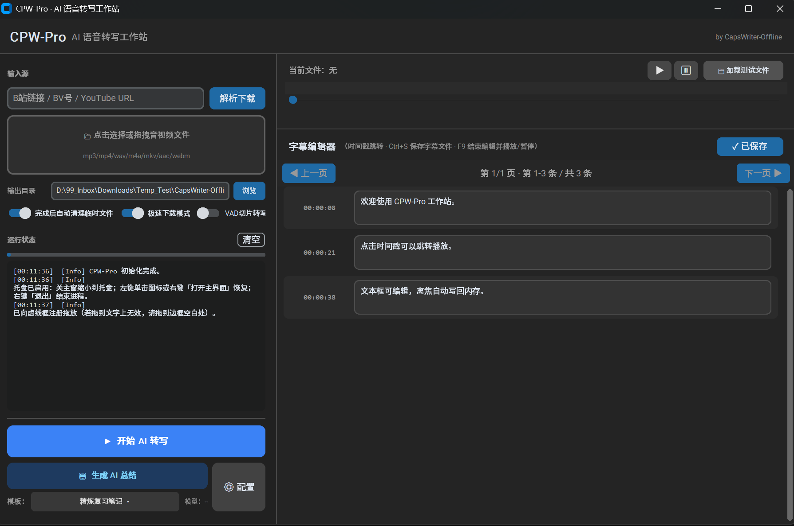
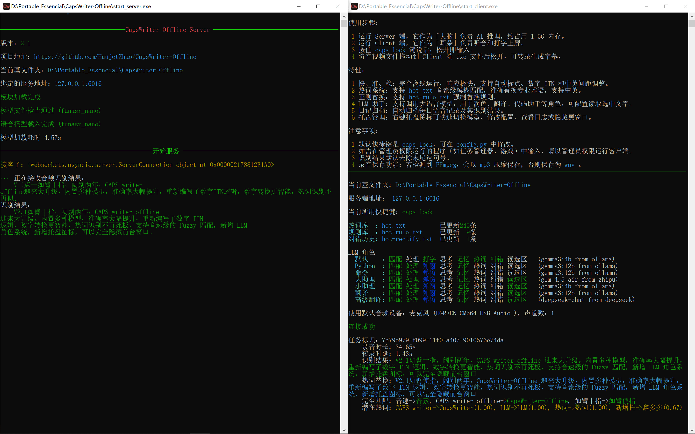

# CPW-Pro · CapsWriter-Offline 扩展套件



**CPW-Pro**（包名 **`cpwpro`**）是在 **[CapsWriter-Offline](https://github.com/HaujetZhao/CapsWriter-Offline)** 之上的一层 **桌面「语音转写工作站」**：把你已经拥有的**官方离线引擎**接到**更清晰的内容创作流水线**里——链接/本地音视频进来，**规整为 16 kHz WAV**，调度 **`start_client.exe`** 做 ASR，再用**波形与时间轴对齐的字幕编辑器**校对，最后可选用 **Prompt 模板 + OpenAI 兼容 API** 生成结构化笔记。**官方负责「听得准」；CPW-Pro 负责「接得顺、改得爽、归档方便」。**

若想**完整阅读本产品说明**（意义、边界、模块级功能表、典型流程），请参阅 **`docs/CPW_PRO_OVERVIEW.zh.md`**。若关心**源码目录与技术拓扑**，请参阅 **`PROJECT_DOCUMENTATION.md`**。

> **重要**：本仓库提供 **CPW-Pro 与工作流脚本**；**语音识别引擎、内置运行时与模型权重**仍须从 [**官方 Releases**](https://github.com/HaujetZhao/CapsWriter-Offline/releases) 与 [**Models**](https://github.com/HaujetZhao/CapsWriter-Offline/releases/tag/models) 获取。本项目为社区扩展，**不与 CapsWriter 官方发行版划等号**；二进制与 GGUF/ONNX 的版权与分发策略以官方为准。

| 项目 | 当前值（发版时请与 `cpwpro/_version.py` 同步核对） |
|------|-----------------------------------------------|
| **CPW-Pro 版本** | `1.0.0` |
| **已验证的官方引擎** | 与官方 readme 所述 **v2.5-alpha** 及 **同目录结构的 [Latest Release](https://github.com/HaujetZhao/CapsWriter-Offline/releases/latest)** 联调（结构含 `start_server.exe`、`start_client.exe`、`internal/`、`models/` 等）；验证参考日期 **2026-05** |

**兼容性**：CPW-Pro 依赖「官方绿色包」的**目录布局与 exe 调用方式**。若官方日后更改文件名、路径或转写协议，可能需要更新本扩展；请关注你自己仓库主页上的 **「Releases」** 页的兼容性说明（在 GitHub 仓库页点击 *Releases → 查看最新版说明*）。

---

## CPW-Pro 解决什么问题？

| 痛点 | CPW-Pro 的做法 |
|------|----------------|
| 只有 URL / 合集素材，先要下载再转容器 | **yt-dlp 解析下载**（可选网络） + **ffmpeg 抽音频**统一到 **16 kHz mono WAV** |
| 黑窗口日志难读、不知道卡在哪一段 | **`cpwpro.worker` + progress 日志解析**，主界面日志与繁忙状态一体展示 |
| 转完要试听、波形对轨、分页改错别字 | **内置播放器**（sounddevice/soundfile）、**波形与卡拉 OK 高亮行**、**字幕分页编辑**，**Ctrl+S** 落盘 **SRT** |
| 极长音视频一次喂给 client 压力大 | **VAD 切片转写（可选）**：静音切段 → 分段转写 → **时间轴拼回**（`cpwpro/support/vad_utils.py`，不碰服务端模型代码） |
| 想判断时间戳是「声学对齐」还是「均匀占位」启发式提示 | **`timestamp_quality` 只读诊断**，结果打在日志 `[TimeDiag]` |
| 希望把字幕变成复习笔记 / 纪要 / Markdown | **`prompts.json` 模板库** + **`llm_client` 流式 SSE**（与官方 `util/llm/` 语音角色系统是**两套能力**，可同时存在） |

---

## CPW-Pro 功能一览（精要）

- **输入**：链接框（BV/通用 URL）+ **拖放本地媒体**（tkinterdnd2；可选用 `CPW_DISABLE_TKDND=1` 关闭拖放）。
- **转写链路**：ffmpeg 预处理 → （可选 **VAD**）→ **`start_server` 检测或提示** → 子进程 **`start_client`** → 载入 **SRT/JSON**。
- **审听与校对**：暂停/拖动进度、**F9 / Ctrl+F9** 绑定播放与字幕区内快捷操作。
- **设置**：`config.json` / `config.example.json`；API **Base URL**、模型名、多套**服务商预设**，以及 **Prompt** 库的增删改。
- **系统托盘**：`pystray` + `Pillow`；支持 **`CPW_TRAY_NO_HIDE`**（关窗即退出）、**`CPW_TRAY_DISABLE`**（不启用托盘）、**`CPW_TRAY_ICON`**（自定义图标）。
- **启动**：`python -m cpwpro`、`launcher\Launch_CPW-Pro.bat`、静默 **`Launch_CPW-Pro-quiet.vbs`**（pythonw）。
- **支撑代码位置**：工作台专用逻辑集中于 **`cpwpro/`** 与 **`cpwpro/support/`**（配置、HTTP LLM、本地音频引擎、VAD、时间戳诊断），**不 import 官方 ASR 推理内核**。

---

## 与官方 CapsWriter 的关系（不重复、不弱化）

下表帮助读者**同时重视两边**：官方 README（本页「附录」全文保留）写的是**听写输入法级别的体验**；CPW-Pro 写的是**音视频内容生产侧的 GUI**。

| 能力维度 | CapsWriter（官方） | CPW-Pro（本扩展） |
|----------|---------------------|---------------------|
| 实时快捷键听写 | 核心场景 | **不替换**；仍用官方 client |
| 单文件甩给 exe 转写 | 支持 | **编排 + 预处理 + UI** |
| 链接下载 / 拖拽队列 / 波形字幕编辑 | — | **主战场** |
| ASR 模型与 WebSocket | 核心实现 | **通过 exe 调度，不绕过** |

---

## 典型场景（可以这样用）

1. **课程回放 → 字幕稿**：粘贴链接 → 转写 → 卡拉 OK 校对 → 导出 **SRT** → 归档或上传。  
2. **访谈 / 录音 → Markdown 笔记**：转写后在 **AI 笔记**中选「会议纪要」「复习笔记」等模板 → **流式**生成 → **复制或 .md**。  
3. **长播客切段**：勾选 **VAD 切片转写**（需 **pydub** 依赖就绪）减轻单次解码压力后再合并字幕。

---

## 文档从哪里读？

| 需求 | 建议阅读 |
|------|----------|
| **5 分钟装机 + Release** | 下文 **三步凑齐**、**维护者** 与 **`docs/RELEASE_GUIDE.zh.md`** |
| **产品愿景与功能边界（本文档级补充）** | **`docs/CPW_PRO_OVERVIEW.zh.md`** |
| **源码结构 / 架构图 / 文件名** | **`PROJECT_DOCUMENTATION.md`** |
| **克隆或小仓库补齐 exe/model** | **`GITHUB_CLONE_SETUP.md`** |

---

## 最终用户：三步凑齐「引擎 + 扩展」

### ① 引擎与运行时（官方）

1. 安装 [VC++ 运行库](https://learn.microsoft.com/zh-cn/cpp/windows/latest-supported-vc-redist)。  
2. **[软件本体](https://github.com/HaujetZhao/CapsWriter-Offline/releases/latest)** 解压到任意目录（例如 `D:\CapsWriter\`）。  
3. **[模型包](https://github.com/HaujetZhao/CapsWriter-Offline/releases/tag/models)** 按官方说明解压到 `models\` 下对应子目录。  

### ② CPW-Pro 叠加包（本仓库）

任选其一：

- GitHub **Releases** 中下载 **`CPW-Pro-overlay-版本号.zip`**（推荐：仅含可分发源码与小资源），解压后 **全部合并复制**到上一步同一**根目录**（覆盖时注意保留官方 `internal/`、`start_*.exe`、模型）；或  
- `git clone` 本仓库到临时目录再复制同上（详解见 **`GITHUB_CLONE_SETUP.md`**）。

### ③ Python 依赖与启动

在**上述根目录**打开终端（建议 Python 3.11+）：

```text
python -m venv myenv
myenv\Scripts\activate
pip install -r requirements.txt
```

先启动官方的 **`start_server.exe`**（听写服务端），再在项目根目录运行：

```text
python -m cpwpro
```

Windows 也可用 **`launcher\Launch_CPW-Pro.bat`**（有控制台便于排错），或 **`launcher\Launch_CPW-Pro-quiet.vbs`**（无黑窗，`pythonw`）。

- 首次运行会生成 **`config.json`**（已 `.gitignore`，勿提交密钥）；可先复制 **`config.example.json`**。  
- **托盘**：关主窗可缩小到系统托盘（需依赖已装 `pystray`、`Pillow`，见 `requirements.txt`）。  
- **可选资源**：`assets\icon.ico`；托盘图可选 `assets\cpw_pro_tray.png` 或环境变量 **`CPW_TRAY_ICON`**。

更深结构与「为什么这样分层」请读 **`PROJECT_DOCUMENTATION.md`** 与 **`docs/CPW_PRO_OVERVIEW.zh.md`**。

---

## 维护者：发 GitHub Release 前

- **打包**：在仓库根目录执行 **`.\scripts\make_release_overlay.ps1`** → 生成 `dist\CPW-Pro-overlay-<版本>.zip`（`-DryRun` 预演）；详见 **`docs/RELEASE_GUIDE.zh.md`**。
- **权限/法务/Release 文案清单**：同上文档；Release 附件**勿含**官方 `internal`、`exe`、模型与用户 `config.json`。

---

## 权限与隐私（简要）

| 类型 | 说明 |
|------|------|
| 麦克风 | 由 CapsWriter 客户端负责录音；使用 CPW-Pro 的下载/LLM 等功能时按你的操作触发。 |
| 网络 | `yt-dlp`、在线 LLM API 等仅在用户使用对应功能时访问网络。 |
| 剪贴板 | 「复制」类功能使用系统剪贴板。 |
| 本地文件 | 输出目录、临时文件由配置指定；请自行备份与清理。 |

---

## 文档索引

| 文件 | 内容 |
|------|------|
| `GITHUB_CLONE_SETUP.md` | 克隆后如何补齐官方二进制与模型 |
| `docs/CPW_PRO_OVERVIEW.zh.md` | CPW-Pro **产品说明书**：愿景、痛点、模块功能、边界、典型场景 |
| `PROJECT_DOCUMENTATION.md` | **技术全景**：拓扑、目录、引擎与 CPW-Pro 分界 |
| `docs/RELEASE_GUIDE.zh.md` | 发布、合规与兼容性维护 |

---

<details>
<summary><strong>附录：CapsWriter-Offline 原版 README（上游：离线听写输入法核心说明 + 致谢，全文保留）</strong></summary>

# CapsWriter-Offline (v2.5)



> **按住 CapsLock 说话，松开就上屏。就这么简单。**

**CapsWriter-Offline** 是一个专为 Windows 打造的**完全离线**语音输入工具。


## 🚀 更新说明：

v2.5-alpha 新增：
- **初步引入 [Qwen3-ASR-1.7B](https://github.com/HaujetZhao/Qwen3-ASR-GGUF) 模型支持，140ms 极速推理，准确率夯爆**
  - Qwen3-ASR-1.7B 只是初步引入，只支持语音输入，没有时间戳，无法转录文件
  - Decoder Vulkan 加速默认打开，需占 1.6GB 显存
  - 显卡空闲时，会降低显存频率，冷启动转录延迟升至 300ms 
  - 若用管理员权限运行 `nvidia-smi -lmc 9000` 锁定显存不降频，实测 RTX5050 转录延迟可降至 100ms

v2.4新增：
- **改进 [Fun-ASR-Nano-GGUF](https://github.com/HaujetZhao/Fun-ASR-GGUF) 模型，使 Encoder 支持通过 DML 用显卡（独显、集显均可）加速推理，Encoder 和 CTC 默认改为 FP16 精度，以便更好利用显卡算力**，短音频延迟最低可降至 200ms 以内。
  - 若用管理员权限运行 `nvidia-smi -lmc 9000` 锁定显存不降频，实测 RTX5050 转录延迟可降至 100ms
- 服务端 Fun-ASR-Nano 使用单独的热词文件 hot-server.txt ，只具备建议替换性，而客户端的热词具有强制替换性，二者不再混用
- 可以在句子的开头或结尾说「逗号、句号、回车」，自动转换为对应标点符号，支持说连续多个回车。
- Fun-ASR-Nano 加入采样温度，避免极端情况下的因贪婪采样导致的无限复读
- 服务端字母拼写合并处理

v2.3新增：
- **引入 [Fun-ASR-Nano-GGUF](https://github.com/HaujetZhao/Fun-ASR-GGUF) 模型支持，推理更轻快**
- 重构了大文件转录逻辑，采用异步流式处理
- 优化中英混排空格
- 增强了服务端对异常断连的清理逻辑

v2.2 新增：
-   **改进热词检索**：将每个热词的前两个音素作为索引进行匹配，而非只用首音素索引。
-   **UDP广播和控制**：支持将结果 UDP 广播，也可以通过 UDP 控制客户端，便于做扩展。
-   **Toast窗口编辑**：支持对角色输出的 Toast 窗口内容进行编辑。
-   **多快捷键**：支持设置多个听写键，以及鼠标快捷键，通过 pynput 实现。
-   **繁体转换**：支持输出繁体中文，通过 zhconv 实现。

v2.1 新增：
-   **更强的模型**：内置多种模型可选，速度与准确率大幅提升。
-   **更准的 ITN**：重新编写了数字 ITN 逻辑，日期、分数、大写转换更智能。
-   **RAG 检索增强**：热词识别不再死板，支持音素级的 fuzzy 匹配，就算发音稍有偏差也能认出。
-   **LLM 角色系统**：集成大模型，支持润色、翻译、写作等多种自定义角色。
-   **纠错检索**：可记录纠错历史，辅助LLM润色。
-   **托盘化运行**：新增托盘图标，可以完全隐藏前台窗口。
-   **完善的日志**：全链路日志记录，排查问题不再抓瞎。

这个项目鸽了整整两年，真不是因为我懒。在这段时间里，我一直在等一个足够惊艳的离线语音模型。Whisper 虽然名气大，但它实际的延迟和准确率始终没法让我完全满意。直到 `FunASR-Nano` 开源发布，它那惊人的识别表现让我瞬间心动，它的 `LLM Decoder` 能识别我讲话的意图进而调整输出，甚至通过我的语速决定在何时添加顿号，就是它了！必须快马加鞭，做出这个全新版本。


## ✨ 核心特性

-   **语音输入**：按住 `CapsLock键` 或 `鼠标侧键X2` 说话，松开即输入，默认去除末尾逗句号。支持对讲机模式和单击录音模式。
-   **文件转录**：音视频文件往客户端一丢，字幕 (`.srt`)、文本 (`.txt`)、时间戳 (`.json`) 统统都有。
-   **数字 ITN**：自动将「十五六个」转为「15~16个」，支持各种复杂数字格式。
-   **热词语境**：在 `hot-server.txt` 记下专业术语，经音素筛选后，用作 Fun-ASR-Nano 的语境增强识别 
-   **热词替换**：在 `hot.txt` 记下偏僻词，通过音素模糊匹配，相似度大于阈值则强制替换。
-   **正则替换**：在 `hot-rule.txt` 用正则或简单等号规则，精准强制替换。
-   **纠错记录**：在 `hot-rectify.txt` 记录对识别结果的纠错，可辅助LLM润色。
-   **LLM 角色**：预置了润色、翻译、代码助手等角色，当识别结果的开头匹配任一角色名字时，将交由该角色处理。
-   **托盘菜单**：右键托盘图标即可添加热词、复制结果、清除LLM记忆。
-   **C/S 架构**：服务端与客户端分离，虽然 Win7 老电脑跑不了服务端模型，但最少能用客户端输入。
-   **日记归档**：按日期保存你的每一句语音及其识别结果。
-   **录音保存**：所有语音均保存为本地音频文件，隐私安全，永不丢失。

**CapsWriter-Offline** 的精髓在于：**完全离线**（不受网络限制）、**响应极快**、**高准确率** 且 **高度自定义**。我追求的是一种「如臂使指」的流畅感，让它成为一个专属的一体化输入利器。无需安装，一个U盘就能带走，随插随用，保密电脑也能用。

LLM 角色既可以使用 Ollama 运行的本地模型，又可以用 API 访问在线模型。


## 💻 平台支持

目前**仅能保证在 Windows 10/11 (64位) 下完美运行**。

-   **Linux**：暂无环境进行测试和打包，无法保证兼容性。
-   **MacOS**：由于底层的 `keyboard` 库已放弃支持 MacOS，且系统权限限制极多，暂时无法支持。


## 🎬 快速开始

1.  **准备环境**：确保安装了 [VC++ 运行库](https://learn.microsoft.com/zh-cn/cpp/windows/latest-supported-vc-redist)。
2.  **下载解压**：下载 [Latest Release](https://github.com/HaujetZhao/CapsWriter-Offline/releases/latest) 里的软件本体，再到 [Models Release](https://github.com/HaujetZhao/CapsWriter-Offline/releases/tag/models) 下载模型压缩包，将模型解压，放入 `models` 文件夹中对应模型的文件夹里。
3.  **启动服务**：双击 `start_server.exe`，它会自动最小化到托盘菜单。
4.  **启动听写**：双击 `start_client.exe`，它会自动最小化到托盘菜单。
5.  **开始录音**：按住 `CapsLock键` 或 `鼠标侧键X2` 就可以说话了！


## 💻 CPW-Pro GUI（从源码运行 / 克隆本仓库）

本仓库若在官方发行版基础上增加了 **CPW-Pro**（包名 `cpwpro`），可先按上文准备 **VC++**、**模型** 并照常启动服务端与引擎；在**项目根目录**执行 **`python -m cpwpro`**（有虚拟环境时 `myenv\Scripts\python.exe -m cpwpro`）。**Windows**：可双击 **`launcher\Launch_CPW-Pro.bat`**（有控制台报错信息）或 **`launcher\Launch_CPW-Pro-quiet.vbs`**（静默、无黑窗，需已安装依赖）。**`config.json` 不会进入 Git**：首启 GUI 会自动生成默认配置，随后在 **设置** 中填写 API 等；也可参考 **`config.example.json`**。**从 Git 克隆时**：`models/` 下权重、`internal/`、`start_*.exe` 等仍须自备或从 [官方 Releases](https://github.com/HaujetZhao/CapsWriter-Offline/releases) 获得（见 **`GITHUB_CLONE_SETUP.md`**）。**主窗体与任务栏图标**：`assets\icon.ico`；**托盘专用图**（可选）将 **`assets\cpw_pro_tray.png`** 或 **`assets\cpw_icon_tray.ico`** 放入 `assets\`，或设环境变量 **`CPW_TRAY_ICON`** 指向 ico/png 绝对路径。（详细架构 **`PROJECT_DOCUMENTATION.md`**；托盘需 `pip install pystray pillow`。）


## 🎤 模型说明

你可以在 `config_server.py` 的 `model_type` 中切换：

-   **qwen_asr**：    自带标点，CPU 速度及格，独显加速超快，准确率：夯爆了。
-   **fun_asr_nano**：自带标点，CPU 速度较快，独显加速超快，准确率：顶级。
-   **sensevoice**：  自带标点，CPU 速度超快，准确率：人上人。
-   **paraformer**：  外挂标点，CPU 速度超快，准确率：人上人。


## ⚙️ 个性化配置

所有的设置都在根目录的 `config_server.py` 和 `config_client.py` 里：
-   修改 `shortcut` 可以更换快捷键（如 `right shift`）。
-   修改 `hold_mode = False` 可以切换为“点一下录音，再点一下停止”。
-   修改 `llm_enabled` 来开启或关闭 AI 助手功能。


## 🛠️ 常见问题

**Q: 为什么按了没反应？**  
A: 请确认 `start_client.exe` 的黑窗口还在运行。若想在管理员权限运行的程序中输入，也需以管理员权限运行客户端。

**Q: 为什么识别结果没字？**  
A: 到 `年/月/assets` 文件夹中检查录音文件，看是不是没有录到音；听听录音效果，是不是麦克风太差，建议使用桌面 USB 麦克风；检查麦克风权限。

**Q: 我可以用显卡加速吗？**  
A: 目前 Fun-ASR-Nano 模型支持显卡加速，Encoder 使用 DirectML 加速（默认关闭），Decoder 使用 Vulkan 加速。但是对于高U低显的集显用户，显卡加速的效果可能还不如CPU，可以到 `config_server.py` 中把 `dml_enable` 或 `vulkan_enable` 设为 False 以禁用显卡加速。Paraformer 和 SenseVoice 本身在 CPU 上就已经超快，用 DirectML 加速反而每次识别会有 200ms 启动开销，因此对它们没有支持显卡加速。

**Q: 低性能电脑转录太慢？**  
A:  
1. 对于短音频，`Qwen3-ASR-1.7B` 和 `Fun-ASR-Nano` 在独显上冷启动可以 200~300ms 左右转录完毕，若用管理员权限运行 `nvidia-smi -lmc 9000` 锁定显存不降频，实测 RTX5050 转录延迟可降至 100ms，`sensevoice` 或 `paraformer` 在 CPU 上可以 100ms 左右转录完毕，这是参考延迟。
2. 如果 `Qwen3-ASR-1.7B` 和 `Fun-ASR-Nano` 在集显上太慢，尝试到 `config_server.py` 中把 `dml_enable` 或 `vulkan_enable` 设为 False 以禁用显卡加速。
3. 如果性能较差，还是慢，就更改 `config_server.py` 中的 `model_type` ，切换模型为 `sensevoice` 或 `paraformer`。
4. 如果性能太差，连 `sensevoice` 或 `paraformer` 都还是慢，就把 `num_threads` 降低。

**Q: Fun-ASR-Nano 模型几乎不能用？**  
A: Fun-ASR-Nano 的 LLM Decoder 使用 llama.cpp 默认通过 Vulkan 实现显卡加速，部分集显在 FP16 矩阵计算时没有用 FP32 对加和缓存，可能导致数值溢出，影响识别效果，如果遇到了，可以到 config_server.py 中将 `vulkan_enable` 设为 False ，用 CPU 进行解码。

**Q: 需要热词替换？**  
A: 服务端 Fun-ASR-Nano 会参考 `hot-server.txt` 进行语境增强识别；客户端则会根据 `hot.txt` 的相似度匹配或 `hot-rule.txt` 的正则规则，执行强制替换。若启用了润色，LLM 角色可参考 `hot-rectify.txt` 中的纠错历史。

**Q: 如何使用 LLM 角色？**  
A: 只需要在语音的**开头**说出角色名。例如，你配置了一个名为「翻译」的角色，录音时说「翻译，今天天气好」，翻译角色就会接手识别结果，在翻译后输出。它就像是一个随时待命的插件，你喊它名字，它就干活。你可以配置它们直接打字输出，或者在 TOAST 弹窗中显示。`ESC` 可以中断 LLM 的流式输出。

**Q: LLM 角色模型怎么选？**  
A: 你可以在 `LLM` 文件夹里为每个角色配置后端。既可以用 Ollama 部署本地轻量模型（如 gemma3:4b, qwen3:4b 等），也可以填写 DeepSeek 等在线大模型的 API Key。

**Q: LLM 角色可以读取屏幕内容？**  
A: 是的。如果你的 AI 角色开启了 `enable_read_selection`，你可以先用鼠标选中屏幕上的一段文字，然后按住快捷键说：“翻译一下”，LLM 就会识别你的指令，将选中文字进行翻译。但当所选文字与上一次的角色输出完全相同时，则不会提供给角色，以避免浪费 token。

**Q: 想要隐藏黑窗口？**  
A: 点击托盘菜单即可隐藏黑窗口。

**Q: 如何开机启动？**  
A: `Win+R` 输入 `shell:startup` 打开启动文件夹，将服务端、客户端的快捷方式放进去即可。


## 🚀 我的其他优质项目推荐

| 项目名称 | 说明 | 体验地址 |
| :--- | :--- | :--- |
| [**IME_Indicator**](https://github.com/HaujetZhao/IME_Indicator) | Windows 输入法中英状态指示器 | [下载即用](https://github.com/HaujetZhao/IME_Indicator/releases/latest/download/IME-Indicator.exe) |
| [**Rust-Tray**](https://github.com/HaujetZhao/Rust-Tray) | 将控制台最小化到托盘图标的工具 | [下载即用](https://github.com/HaujetZhao/Rust-Tray/releases/latest/download/Tray.exe) |
| [**Gallery-Viewer**](https://github.com/HaujetZhao/Gallery-Viewer-HTML) | 网页端图库查看器，纯 HTML 实现 | [点击即用](https://haujetzhao.github.io/Gallery-Viewer-HTML/) |
| [**全景图片查看器**](https://github.com/HaujetZhao/Panorama-Viewer-HTML) | 单个网页实现全景照片、视频查看 | [点击即用](https://haujetzhao.github.io/Panorama-Viewer-HTML/) |
| [**图标生成器**](https://github.com/HaujetZhao/Font-Awesome-Icon-Generator-HTML) | 使用 Font-Awesome 生成网站 Icon | [点击即用](https://haujetzhao.github.io/Font-Awesome-Icon-Generator-HTML/) |
| [**五笔编码反查**](https://github.com/HaujetZhao/wubi86-revert-query) | 86 五笔编码在线反查 | [点击即用](https://haujetzhao.github.io/wubi86-revert-query/) |
| [**快捷键映射图**](https://github.com/HaujetZhao/ShortcutMapper_Chinese) | 可视化、交互式的快捷键映射图 (中文版) | [点击即用](https://haujetzhao.github.io/ShortcutMapper_Chinese/) |


## ❤️ 致谢

本项目基于以下优秀的开源项目：

-   [Sherpa-ONNX](https://github.com/k2-fsa/sherpa-onnx)
-   [FunASR](https://github.com/alibaba-damo-academy/FunASR)

感谢 Google Antigravity、Anthropic Claude、GLM，如果不是这些编程助手，许多功能（例如基于音素的热词检索算法）我是无力实现的。

特别感谢那些慷慨解囊的捐助者，你们的捐助让我用在了购买这些优质的 AI 编程助手服务，并最终将这些成果反馈到了软件的更新里。


如果觉得好用，欢迎点个 Star 或者打赏支持：


	

</details>
